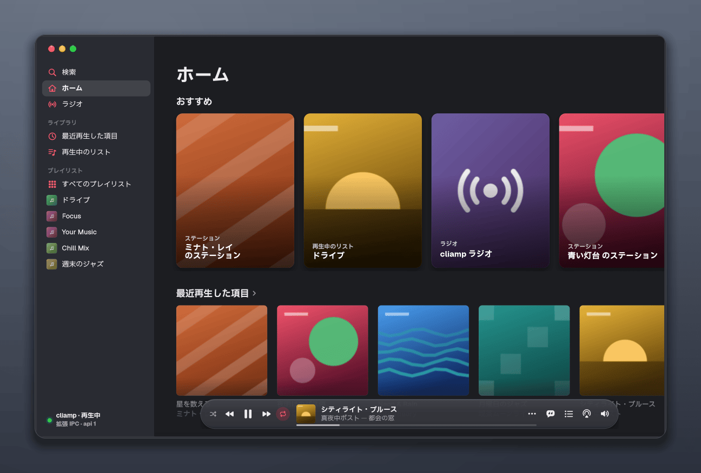
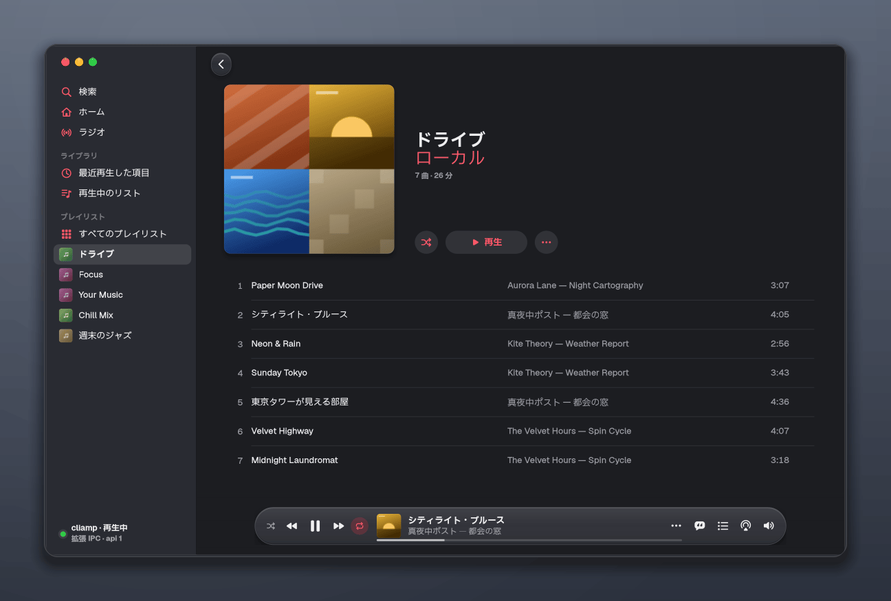
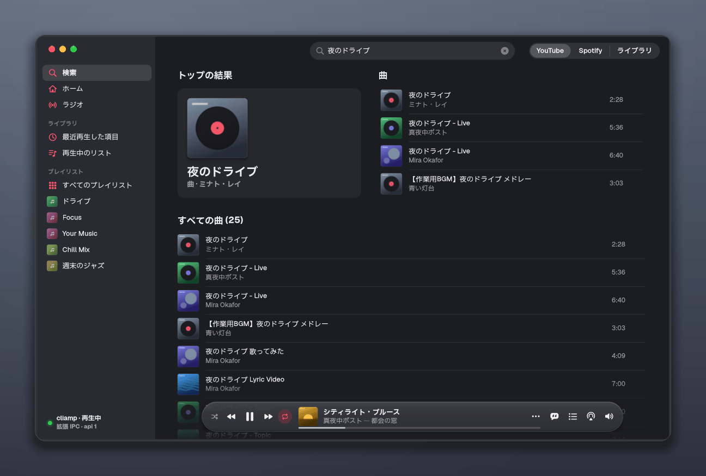
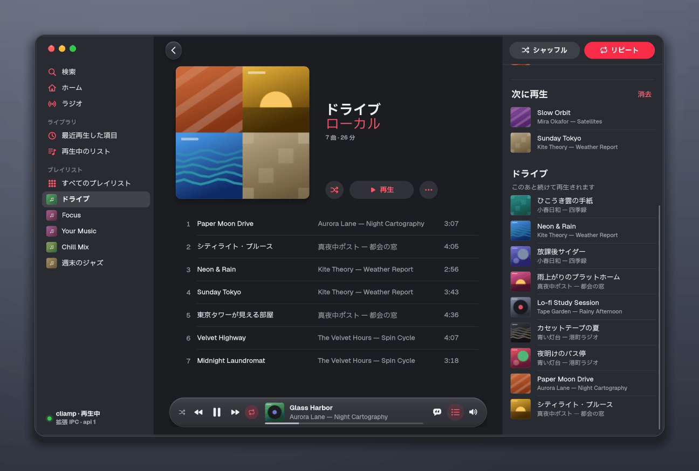
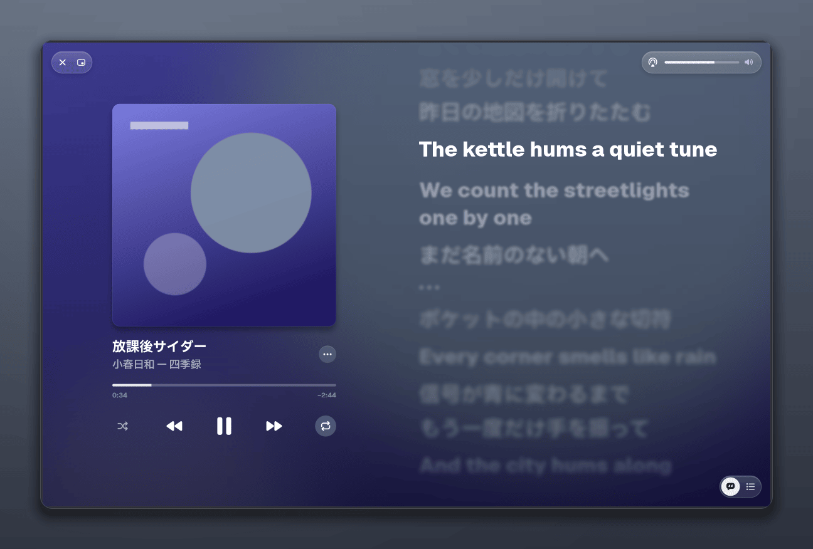
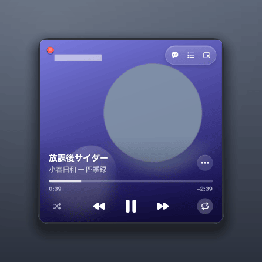

# ミュージック (cliamp-music)

[cliamp](https://github.com/bjarneo/cliamp) 1.50.0 (端末の音楽プレーヤー) を、
macOS 27 の「ミュージック」風に操作する GTK4 + libadwaita のアプリ
(アプリ ID `org.nixos.Music`、実行ファイル `cliamp-music`)。



再生そのものは常駐している cliamp が行い、このアプリは IPC
(`~/.config/cliamp/cliamp.sock`) だけを通して操作する。アプリを閉じても音楽は止まらず、
端末の cliamp (TUI) や、cliamp を操作するほかの道具 (Open-Voice など) と同時に使える。
ライブラリ・検索・次に再生・歌詞などを使うには、cliamp 側にも IPC の拡張
(`patches/cliamp-1.50.0-gui-ipc.patch`、仕様は [PROTOCOL.md](PROTOCOL.md)) を当てる。
当てていない cliamp にも繋がり、そのときは再生の操作だけが使える。画面の設計は
[DESIGN.md](DESIGN.md)。

## できること

- **サイドバー**: 検索・ホーム・ラジオ、ライブラリ (最近再生した項目・再生中のリスト)、
  プレイリスト (cliamp のローカルのプレイリストと、Spotify など cliamp に登録された
  プロバイダーのもの)。窓の端まで続く macOS 27 の形で、記号は赤。
- **再生バー**: 画面の下に浮かぶガラスのカプセル。シャッフル・前へ・再生・次へ・
  リピート、アートワークと曲名、ドラッグでシークできる細い線、再生速度・イコライザ・
  リンクのコピー、歌詞と次に再生のパネル、出力先 (cliamp の `device`)、音量。
- **ホーム**: 最近再生した YouTube の曲から作るステーション (YouTube のミックス)、
  最近再生した項目、プレイリスト、日本の人気のラジオ局。
- **検索**: YouTube (cliamp の yt-dlp の検索)、Spotify (登録されていれば。自前の client_id では
  Spotify が検索を止めているので [下](#spotify-無料プラン))、ライブラリ
  (ローカルのプレイリストと履歴)。トップの結果と曲の一覧、最近の検索、カテゴリーのタイル。
- **ラジオ**: cliamp ラジオ (組み込みの局とお気に入り) と
  [Radio Browser](https://www.radio-browser.info/) の人気局・局の検索。
- **プレイリストの詳細と再生中のリスト**: アルバムのページの形。再生中の行に動くバー。
  「…」メニューから次に再生・最後に再生・プレイリストに追加・ステーションを作成など。
- **右パネル**: 歌詞 (cliamp が LRCLIB / NetEase から取る同期歌詞。今の行を追い、
  行を押すとその時刻へ) と、次に再生 (待ち行列・このあとの曲・履歴)。
- **フルスクリーンプレーヤー**: アートワークをぼかした背景に大きな歌詞か次に再生。
- **ミニプレーヤー** (アートワーク全面の正方形と横長) と **イコライザ** (cliamp の
  10 バンドとプリセット、再生速度)。
- 再生に失敗したときは、理由 (「YouTube のサインインが必要な曲です」など) を再生バーと
  トーストに出す。cliamp が止まっている・繋がらないときは「cliamp を起動」を出し、
  繋ぎ直す。

| | |
|---|---|
|  |  |
|  |  |



画面写真は試験用の偽の cliamp (`tests/fake_cliamp.py`) と、そのために描いた絵で撮ったもの
(`scripts/shoot.py`)。

## 仕組み

```
ミュージック (GTK) ──IPC (改行区切りの JSON)──▶ cliamp (tmux の中の TUI、常駐)
                     ~/.config/cliamp/cliamp.sock        └ 再生・yt-dlp・プロバイダー
```

- 状態は専用の接続で 0.4 秒ごとに取る (窓が隠れている間は 1.5 秒)。状態を変える操作は
  送った順に届け、検索のような遅い要求に待たされない列に分けてある。
- パッチは cliamp の IPC にコマンドを **足す** だけで、既存のコマンド・`cliamp status` の
  平文の出力・TUI のキー操作は変えない (Open-Voice がそれで cliamp を操作しているため)。
  ネットワークを待つ要求 (検索・プレイリスト・歌詞) は TUI の描画を止めない所で処理する。
- アプリは MPRIS の名前を取らない (GNOME のメディアの操作や Open-Voice からは、今まで
  どおり cliamp が 1 つのプレーヤーとして見える)。
- アートワークは cliamp が持っていないので、アプリが曲から求める: YouTube の曲は
  サムネイル (黒帯を除いて正方形に切り抜く)、Spotify は oEmbed (YouTube で探して鳴らす
  Spotify の曲も、探した動画ではなく Spotify のアルバムの絵)、手元のファイルは埋め込みの
  絵か同じフォルダの cover.jpg、ラジオは局の favicon。取れなければ色の代わりの絵。
  `~/.cache/cliamp-music/` に 256 MiB まで置く。

## NixOS で使う

flake の入力に足し、モジュールを読み込む:

```nix
{
  inputs.cliamp-music = {
    url = "github:hatake716/cliamp-frontend";
    # 手元のクローンを使うなら: url = "git+file:///path/to/cliamp-frontend?ref=main";
    inputs.nixpkgs.follows = "nixpkgs";
  };

  outputs = { nixpkgs, cliamp-music, ... }: {
    nixosConfigurations.nixos = nixpkgs.lib.nixosSystem {
      modules = [
        cliamp-music.nixosModules.default
        {
          programs.cliamp-music.enable = true;
          # programs.cliamp-music.patchCliamp = true;     # 既定。pkgs.cliamp に拡張を当てる
          # programs.cliamp-music.hideGnomeMusic = true;  # GNOME の「ミュージック」を外す (下)
        }
      ];
    };
  };
}
```

- `programs.cliamp-music.enable`: アプリを入れる (`environment.systemPackages`)。
- `patchCliamp` (既定 `true`): overlay で `pkgs.cliamp` を拡張を当てたもの (`cliamp.nix`)
  に差し替える。差し替えは `pkgs.cliamp` を使うところすべて (cliamp を常駐させる
  サービス、端末の cliamp、Open-Voice が呼ぶ cliamp) に及ぶ。拡張は既存のコマンドと
  `cliamp status` の出力を変えない。
- `hideGnomeMusic` (既定 `false`): `environment.gnome.excludePackages` に
  `pkgs.gnome-music` を足す。

cliamp を常駐させるユーザーのサービス (`cliamp.service`) は、このモジュールでは定義しない
(利用者の構成が持っている前提)。未接続の画面の「cliamp を起動」ボタンは
`systemctl --user start cliamp.service` を走らせる。別のやり方で起こすなら、環境変数
`CLIAMP_MUSIC_START_COMMAND` に起こすコマンドを入れる。

### 有効にした最初の switch で cliamp が起こし直される

`patchCliamp` (既定で有効) は `pkgs.cliamp` を替えるので、それを使う `cliamp.service` の
ユニットも変わる。NixOS の switch は変わったユーザーのユニットを止めて起こし直すため、
**有効にした最初の `nixos-rebuild switch` (と、パッチを直すたび) に cliamp が止まり、
再生が 1 度止まる**。避けるには次のどれか:

- 何も鳴らしていないときに switch する。
- `nixos-rebuild boot` にして、次に起動したときに替える。
- ホストの構成で `systemd.user.services.cliamp.restartIfChanged = false;` にし、都合の
  よいときに `systemctl --user restart cliamp` する。

起こし直すまでは古い (拡張の無い) cliamp が動いているので、アプリは上端に
「この cliamp は拡張 IPC に対応していません」の帯を出し、再生の操作だけになる。

nixpkgs の cliamp の版が 1.50.0 から変わると、`cliamp.nix` が評価の時点で止まる
(パッチを当て直すまで)。急ぐときは `programs.cliamp-music.patchCliamp = false;` で
差し替えを外せる (アプリは再生の操作だけになる)。

### 出力先の切り替えと pactl

cliamp の出力先の一覧と切り替え (アプリの出力先のメニュー、TUI の出力先の選択、
`cliamp device`) は `pactl` を呼ぶ。NixOS + PipeWire では pactl が入らないので、
`cliamp.nix` は差し替えた cliamp の PATH の後ろに pulseaudio の pactl を足す。
`patchCliamp = false` のときは差し替えないので、`cliamp.service` の PATH に pactl
(`pkgs.pulseaudio`) を足さないと、出力先のメニューは「pactl が見つかりません」になる。

### GNOME の「ミュージック」と重なる

GNOME の「ミュージック」(gnome-music) も日本語では「ミュージック」と表示され、WhiteSur
などのテーマではアイコンもほぼ同じ赤い四角の音符になる。アプリの一覧や検索で見分けられ
ないので、使わないなら `programs.cliamp-music.hideGnomeMusic = true;` (または
`environment.gnome.excludePackages = [ pkgs.gnome-music ];`) で外す。

## キー操作

macOS の Command は Ctrl に置き換えてある。

| キー | 動作 |
|---|---|
| Space | 再生 / 一時停止 (文字の入力中とメニューの中は除く) |
| Ctrl+→ / Ctrl+← | 次へ / 前へ |
| Shift+Ctrl+→ / ← | 10 秒進む / 戻る (Ctrl+Alt+矢印は GNOME の作業領域の切り替えと重なるため) |
| Ctrl+↑ / Ctrl+↓ | 音量 ±2 dB |
| Ctrl+. | 停止 |
| Ctrl+L | 再生中の曲をリストで表示 |
| Ctrl+F | 検索 |
| Ctrl+Alt+U | 次に再生 (右パネル) |
| Shift+Ctrl+L | 歌詞 (右パネル) |
| Shift+Ctrl+F | フルスクリーンプレーヤー (Esc で戻る) |
| Shift+Ctrl+M | ミニプレーヤー |
| Ctrl+Alt+E | イコライザ |
| Ctrl+R | ページを更新 |
| Ctrl+0 | メインの窓 |
| Ctrl+W / Ctrl+Q | 窓を閉じる / 終了 (cliamp の再生は続く) |

## Spotify (無料プラン)

cliamp の Spotify は、曲そのものを librespot (Spotify の再生の仕組み) で受けて鳴らすので、
Spotify から直接鳴らせるのは Premium の利用者だけ。無料プランでもプレイリストを使えるように、
パッチは Spotify の接続を 2 つの形で扱う。

- **Premium** (librespot のセッションが作れる): 今までどおり。曲は Spotify から直接鳴り、
  `spotify_credentials.json` の形も変わらない。
- **Web API だけ**: サインイン (OAuth) は済んだが、Spotify が librespot のセッションを断った
  とき (自分で登録した client_id のトークンに `login5` が `INVALID_CREDENTIALS` を返す、
  無料プランにアクセスポイントが Premium を求める、など。一時的なネットワークの失敗は含まない)。cliamp はトークンを捨てずに Web API だけを使い、
  プレイリストと保存した曲 (Your Music) の一覧は Spotify から取る。曲は **YouTube で探して
  鳴らす** (Spotify の曲名とアーティストで yt-dlp の `ytsearch1:` を引き、最初に見つかった動画を
  鳴らす。ライブ版やカバーが当たることもある)。曲名・アルバム・長さ・アートワークは Spotify の
  もので、「リンクをコピー」も Spotify の曲を指す。アプリのプレイリストの詳細とすべての
  プレイリストの Spotify の節には「曲は YouTube で探して再生します」と出る。リフレッシュ
  トークンは Web API だけの印と一緒に `spotify_credentials.json` に残るので、次からはブラウザを
  開かずに繋がる (librespot は試し直さないので、Premium にしたら `cliamp spotify reset` して
  サインインし直す)。

無料プランでも、Spotify が librespot のセッションを断らなかったとき (組み込みの共有の
client_id で起きた) は Web API だけの接続にならず、曲は Spotify から鳴らそうとして失敗する。
無料プランでは下のとおり自分の client_id を使う。

使い方: [cliamp の説明](https://github.com/bjarneo/cliamp/blob/main/docs/spotify.md) のとおり
[Spotify for Developers](https://developer.spotify.com/dashboard) でアプリを作り (開発モードで
よい。Redirect URI は `http://127.0.0.1:19872/login`)、その Client ID を
`~/.config/cliamp/config.toml` の `[spotify]` の `client_id` に書く。サインインは端末の cliamp で
行う (アプリからは始めない)。

- **検索**: 開発モードのアプリからの `/v1/search` は Spotify が止めている (400 "Invalid limit")。
  検索の「Spotify」の範囲では英語の誤りの代わりに「Spotify では検索できません」と出し、
  「YouTube で検索」のボタンで YouTube の範囲に替えて探し直せる。プレイリストと保存した曲は
  そのまま使える。`client_id` を書かないときの cliamp の組み込みの共有の client_id は、世界中で
  共有されているため回数の制限 (1 日待てと言われることもある) にかかりやすい。
- **回数の制限**: Spotify の Web API に待つよう言われたとき (429 の Retry-After)、cliamp は短い
  待ち (30 秒まで) だけ待ってやり直し、それより長ければ待たずに失敗を返す (何時間も止まった
  ままにならない)。アプリは「Spotify から回数の制限を受けています。24 時間ほど待ってから、
  もう一度試してください」のように待つ長さを出す。
- Web API だけの接続では、`spotify:track:` の曲 (前に Premium で作ったリストなど) は鳴らせず、
  再生バーに「Spotify の曲の再生には Premium が必要です」と出る。

## 制限

- 配色は暗色だけ (このアプリを作った環境が暗色で固定のため)。
- ライブラリに出るのは cliamp が持っているものだけ: ローカルのプレイリスト (TOML)、
  履歴、cliamp に登録したプロバイダー (Spotify・Navidrome・Jellyfin など) のプレイリスト。
  YouTube Music のライブラリは、cliamp に Google の OAuth の client_id / client_secret を
  設定してサインインしない限り出ない (検索と再生は yt-dlp で使える)。
- サインインはアプリからは始めない (cliamp がブラウザを開くため)。端末の cliamp で行う。
- 歌詞は行ごと (cliamp の LRC)。Apple のような単語ごとの色の移り変わりは無い。
- ローカルのプレイリストに保存できるのは cliamp の TOML にある項目だけなので、ラジオの局
  (ライブ配信) は「プレイリストに追加」できない。
- 確かめたのは Xvfb (合成なし、cairo の描画) と、無音の出口で動かした本物のパッチ済み
  cliamp まで。Wayland の合成あり・GL の描画・HiDPI での見え方は実機で確かめていない。

## 開発

```sh
nix develop path:.            # Python 3.13 + PyGObject + mutagen、GTK 4 / libadwaita、Xvfb、Go

# 単体試験 (画面を使う試験は私用の Xvfb で。利用者の画面・cliamp には繋がない)
nix develop path:. -c bash -c 'unset WAYLAND_DISPLAY; export GDK_BACKEND=x11 GSK_RENDERER=cairo \
  GDK_DEBUG=no-portals ADW_DISABLE_PORTAL=1 GTK_A11Y=none GIO_USE_VFS=local; \
  xvfb-run -n 97 -s "-screen 0 1600x1200x24" dbus-run-session -- python3 -m unittest discover -s tests'

# 窓を出さない自己診断 (モジュール・CSS・アイコン・gdk-pixbuf の読み込み口)
nix develop path:. -c env PYTHONPATH=. python3 -m cliamp_music --self-check

# 全画面の撮影 (偽の cliamp で。--keys は xdotool で本物のキーも確かめる)
nix shell nixpkgs#xdotool -c nix develop path:. -c \
  xvfb-run -n 97 -s "-screen 0 1600x1100x24" python3 scripts/shoot.py --keys

nix build path:.#cliamp-music   # アプリ (installCheck で画面の要らない試験と --self-check)
nix build path:.#checks.x86_64-linux.ui   # 画面を使う試験を Xvfb の中で
```

`tests/fake_cliamp.py` は PROTOCOL.md を実装した偽の cliamp (本物の振る舞いに合わせて
ある)。`tests/test_conformance.py` は同じ断言を偽と、環境変数
`CLIAMP_MUSIC_REAL_SOCKET` で指した本物のパッチ済み cliamp の両方に当てる (本物は
一時的な HOME で、音は ALSA の null などで鳴らさずに動かすこと)。Spotify が Web API だけで
繋がった cliamp の断言は、偽 (`--spotify-web-only`) にはいつも、本物には
`CLIAMP_MUSIC_REAL_WEBONLY_SOCKET` があるときだけ当てる (本物の Spotify には繋がない)。

## ライセンス

MIT ([LICENSE](LICENSE))。`patches/` のパッチは cliamp (Copyright (c) Bjarne Øverli、
MIT、[patches/LICENSE.cliamp](patches/LICENSE.cliamp)) を変更するもので、差分の文脈として
cliamp のソースの一部を含む。
